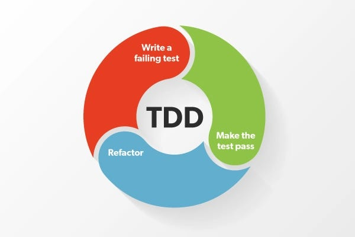

## High Level 

* Preleminary
	* Install Instructions
* Unit Testing Crash Course
* Types of Unit Testing
* Smoke Testing
* Running unit Tests
* How to Write unit Tests 
* Stuff TODO
## Preliminary Important!

---

- Before doing all of this lets install a fresh copy of `csm` into your Clones Directory.
	*  **Rationale:** I've made alot of changes to the codebase and git pull is acting up.
	* Also your venv is most likely going to break so that would mean removing and remaking a new instance.
	* Instead lets just simply create a fresh instance of `csm`.
* **Please save your working version of**  `csm`  as a backup just in case. You can either make a new directory and place it their. Or simply rename it to csm-backup or whatever you wish, just keep it just in case. But you need to do something to it because cloning it will be problematic since it will result in name conflict.

## Install Instructions

This will be similar to the previous set of instructions that we did last time except this time we don't even need to manually delete `greenlet` and the command to run is different.

0. `git clone https://github.com/don1997/csm.git` # Clone in your `\Clones` directory.
1. First cd into the root of `\csm` if you haven't done so.
2. `git checkout v0.5.0` # switch to dev branch
3. `git branch` # Ensure your branch is set to v0.5.0
4. `python -m venv venv` # Install our venv
5. `venv\Scripts\Activate.ps1` # Activate our venv script
6. `pip install -r .\requirements.txt` # Install deps
7. `python src\run.py`  # Run our app
8. `deactivate`  # deactivate venv when finished

## Unit Testing Crash Course

Two acronyms that are important to the subject of unit testing is: AAA and TDD.

TDD := Test Driven Development
AAA := Arrange Act Assert

### TDD
TDD is a **development process** that involves 
*  Creating a test case for a feature that hasn't actually been implemented yet
*  Failing that test case 
*  Writing out the implementation for that feature
* Passing the test
* Refactor the code 

So the three step process most associate with is:
1. Write a failing test
2. Make it pass
3. Refactor

So generally the desired workflow for implementing features is to think of a feature you want then write out the test cases for it, then write your code until you pass your test cases you made prior. 




### AAA

AAA is a **testing pattern** and its process is in the name itself. 

We should organize our unit tests into 3 sections:
* Arrange
* Acting 
* Assert

Essentially in arrange we arrange whatever we need to perform the test, whether it be users, objects, app instance,  etc.

In Act we invoke whatever method we need to do to perform the test.

In Assert we see whether those expectations were met.

```python
def test_home(client):

# Arrange. In this case our flask app was given through the client.

# Act. We need to get ('/') from our client
response = client.get('/')

# Assert. We need then need to check our status codes and HTML data to see if they line up with our expectation.

# If the it works then we pass (GREEN)
# if it doesn't then we fail (RED)
assert response.status_code == 200
assert b"Login Authentication System in Flask." in response.data
```


There is another pattern similar called Given, When, Then. It is very similar to AAA.
```python
def test_home(client):
    """
    GIVEN Flask app
    WHEN the / is requested (GET) 
    THEN check the response is valid and check for the given strin
    """
    response = client.get('/')
    assert response.status_code == 200
    assert b"Login Authentication System in Flask." in response.data


```

As you can see AAA and Given, When, Then essentially do the same thing they offer a structured way to think and organize our unit tests. 

### Types of unit testing we will be doing
* Route testing
* DB Operation Testing


These will be the two main things we can go ahead and start testing within the app itself.

### Route testing
The things we want to test for our routes includes:
* Status codes
* HTML doc content
* Form content
* URL Redirect
* ERROR PAGE and handling

Note: For Route testing we will be relying on a mock user.
### DB Operations
For database operations we want to essentially just test values to make sure they either exist or don't exist depending on what we are trying to do. 

### Smoke testing

Another thing i want to do is to setup a smoke test for our application. Essentially a smoke test is a group of unit tests that tests the core functionality of our app. This ensures our app is in working order whenever we make a change. It would be useful to do this because it will save us from having to open up test instances manually every time we make an important change. 
### Running unit tests 

Make sure your (venv) is active before the running the tests.

To run all of the unit tests in our project simply just hit `pytest`
If you want to run a particular test then specify the directory and the file itself. `pytest /tests/unit/login_test.py`

Also I've already went ahead and made a custom marking and directory for smoke testing in csm/tests/unit/smoke/

Essentially the custom marking allows us to run the that test simply `pytest -m smoke`

### How to write unit tests

I've made several examples our /tests directory.
* conftest.py  __init__.py  __pycache__  unit
is what you will see when you `cd` into it.

Then go into \unit and you will see the following files and directory

db_test.py       home_test.py  login_test.py    __pycache__
example_test.py  __init__.py   not_imp_test.py  **smoke**

---

example_test.py - is a dirt simple test. Just a sanity check to see whether our test function properly.

home_test.py - demonstrates a use of the `client` instance on the login route. Simply asserts for  status code and page content. 

login_test.py - A little more complex but involves us creating a mock user and then logging into the dashboard. From here we can go to other places that require to get passed the user authentication. Use this as a template if you need to do so. 

not_imp_test.py - Shows how to skip a test. Can be useful if we want to write unit tests for features that are not yet implemented. 

**smoke** - This is the folder where we will write our smoke test.py file. This will encompass all of our critical components into a single test file. 

The docs for pytest:
https://docs.pytest.org/en/7.4.x/

## TODO
* Make unit tests for our routes and db operations.
* Make unit tests for our future features such as searching, tagging, pygments, etc.
* Make our smoke tests.
* Set up our page error handling.